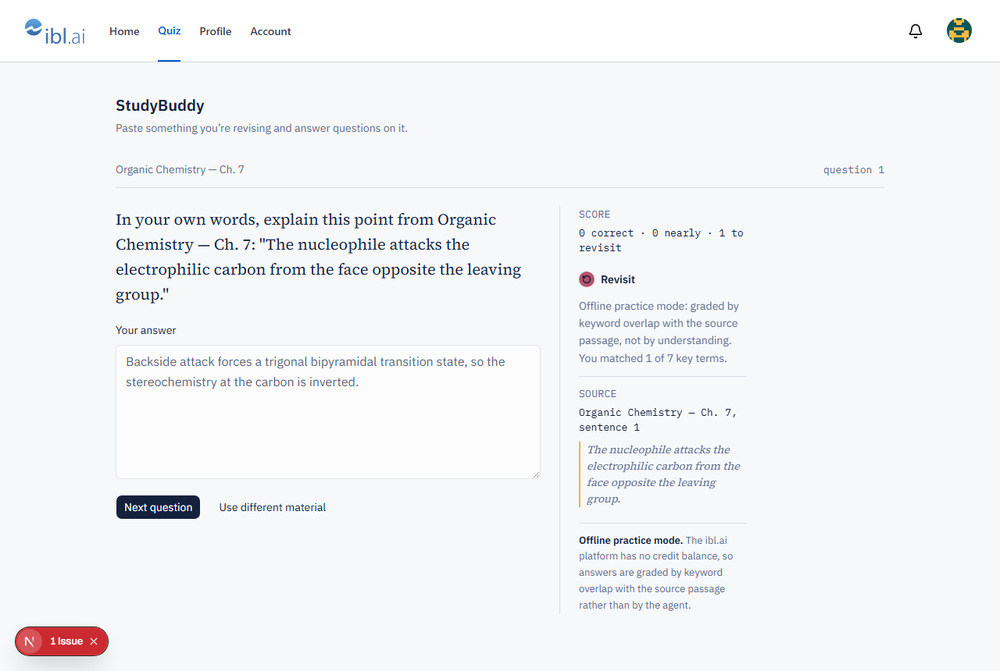
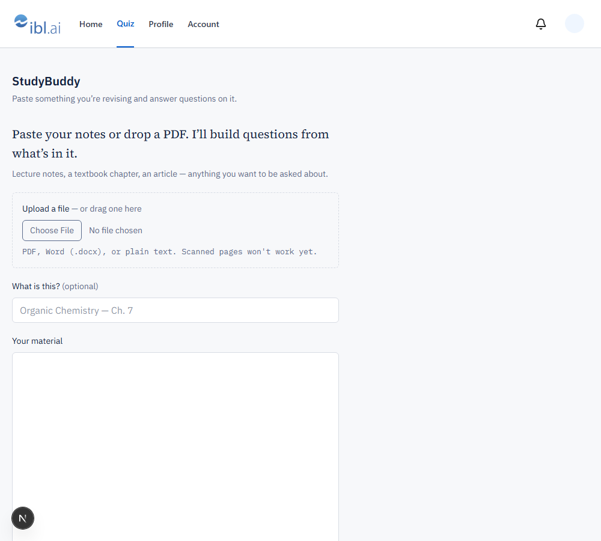
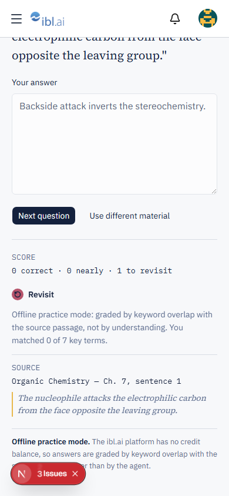

# StudyBuddy

Upload a PDF, a Word document or your notes — or just paste them — and an agent
quizzes you on it, one question at a time, with the evaluation and the source
citation in the margin.

Built as the bonus for the ibl.ai Software Engineer application: scaffolded with
[iblai/vibe](https://github.com/iblai/vibe), extended with a quiz-mode layer.



| | |
|---|---|
| **Live URL** | **https://studdybuddy-lemon.vercel.app** |
| **Baseline commit** | [`b072976`](../../commit/b072976) — the untouched scaffold |
| **Tests** | 64 unit (Vitest) · 11 E2E (Playwright), incl. two axe scans |
| **Lighthouse** | Accessibility **100** · SEO **100** · Best Practices **77** · Performance **41** ([why](#performance)) |
| **Time spent** | roughly six hours |

---

## Status

Honest accounting of what is and isn't done:

| Success criterion | Status |
|---|---|
| Public repo, conventional commits | ✅ 16 commits |
| Working quiz flow | ⚠️ works, but **offline** — the ibl.ai platform has no credits (see below) |
| Deliberate visual identity | ✅ six-token system, documented |
| Deployed URL with working SSO | ✅ [live on Vercel](https://studdybuddy-lemon.vercel.app), SSO verified on the deployed origin |
| Native desktop build | ⚠️ scaffolded, **not built** — no Rust toolchain ([why](docs/DESKTOP_BUILD.md)) |
| Vitest + Playwright + axe | ✅ 64 + 11 green, zero critical/serious a11y violations |
| Performance measured | ⚠️ measured and diagnosed, **not fixed** — Performance 41 ([why](#performance)) |
| Debugging narrative | ✅ below |

**The agent cannot generate.** The ibl.ai platform this was built against sits at
**-65 credits**, so the live agent refuses every request. Rather than fake a
demo, the real transport is implemented and a deterministic offline agent stands
in behind the same interface. Every API response carries `mode: "live" |
"offline"`, and the UI labels offline sessions in the margin rail — stub grading
is never presented as real evaluation.

---

## What the toolkit gave me vs. what I built

The baseline commit [`b072976`](../../commit/b072976) is the untouched
`iblai/vibe-starter@spa`, so `git diff b072976..HEAD` is the honest split.

**From the toolkit:** Next.js 16 App Router scaffold, ibl.ai SSO auth and the
provider chain, Redux store wiring, navbar, profile / account / notifications
pages, the Vitest and Playwright harnesses, and the Tauri templates.

**Mine:**

| Area | Files |
|---|---|
| Quiz domain logic | `lib/quiz/{context,parse,score,prompt,agent,extract,types}.ts` |
| Backend | `app/api/quiz/route.ts`, `app/api/quiz/extract/route.ts` |
| UI | `app/(app)/quiz/`, `components/quiz/*` |
| State | `store/quiz-{api,slice}.ts` |
| Design system | `app/studybuddy.css` |
| Route gate | `proxy.ts`, `components/return-to.tsx`, `lib/return-to.ts` |
| Session hook | `lib/iblai/session.ts` |
| Tests | `__tests__/quiz-*.test.ts`, `__tests__/return-to.test.ts`, `e2e/journeys/{quiz,middleware}.journey.spec.ts` |
| Docs | `docs/{AUTH_NOTES,AGENT_PROTOCOL,DESKTOP_BUILD}.md` |

I also fixed five bugs **in** the scaffold and SDK — those are in the narrative
below. Two of them (the Tailwind symlink, the cookie domain) only reproduce on
particular platforms, which is what made them worth writing up.

---

## Architecture

```
browser                        our server                   ibl.ai
───────                        ──────────                   ──────
MaterialForm (client)
  │  POST /api/quiz/extract   (multipart, one file)
  ├──────────────────────────► app/api/quiz/extract/route.ts
  │                              │ unpdf / mammoth      text
  │  ◄─────────────────────────  └─ { title, body }
  │
QuizSession (client)
  │  POST /api/quiz
  ├──────────────────────────► app/api/quiz/route.ts
  │                              │ buildQuizContext()   bounded excerpt
  │                              │ buildQuestionPrompt()
  │                              │ POST /sessions/  ──────► session_id
  │                              │ wss://…/ws/langflow/ ──► agent
  │                              │ parseQuestion()      typed result
  │  ◄─────────────────────────  └─ { mode, question }
  │
  └─ margin rail renders evaluation + citation + score
```

The browser never talks to ibl.ai for the quiz and never holds an agent
credential — the platform token stays server-side. That property is why the
desktop build loads a remote origin rather than a static export
([DESKTOP_BUILD.md](docs/DESKTOP_BUILD.md)).

The domain layer (`lib/quiz/`) is transport-agnostic and pure, which is what let
it be built and tested before the transport was even known.

---

## Ingesting material

`/quiz` takes **PDF, Word (`.docx`), and plain text (`.txt`, `.md`)** by file
picker or drag-and-drop, or pasted text. Both routes converge on the same
`{ title, body }` the paste form always produced, so nothing downstream — the
context budget, the prompt, the agent — knows uploads exist.



Three decisions worth naming:

**Parsing is server-side.** The obvious alternative is PDF.js in the browser, and
it is the wrong call here: the deployed bundle is already 2.1 MB with a 14.9 s
LCP ([below](#performance)), so adding a parser to the critical path would make
the app's worst measured problem worse. Extraction is also a once-per-session
action, not a per-keystroke one. Server-side gives one failure path instead of
one per browser engine, and `unpdf` ships a PDF.js build compiled for serverless
runtimes specifically.

**Extracted text lands in the textarea, not straight into a session.** Only the
first ~12,000 characters reach the agent. If a 300-page textbook is silently
truncated to its title page and copyright notice, the learner gets questions
about the publisher. Putting the text in front of them — editable, with the
filename shown above it — makes trimming to the chapter they actually care about
the natural next move rather than a feature they have to discover.

**The rules live in one pure module.** `lib/quiz/extract.ts` holds what is
accepted, how big is too big, how a filename becomes a title, and what a scanned
PDF looks like. Both the client (for instant feedback before spending a round
trip) and the route import it, so the two cannot disagree about whether a file is
valid. It has no `File`, no filesystem and no parser in it, which is why the
rules that actually bite are unit-tested without fixtures.

A few details that only show up once you handle real files:

- **PDFs have no paragraphs.** Extractors emit one line per *rendered* line, so
  naive output is a column of fragments and the agent's "¶3" citations become
  meaningless. `cleanExtractedText` rejoins wrapped lines, repairs words
  hyphenated across a break (`nucleo-\nphile` → `nucleophile`), and drops page
  numbers sitting alone on a line — while keeping blank-line paragraph breaks,
  which is the whole point.
- **A near-empty PDF is a scan, not an empty document.** Telling someone their
  file "contains no text" sends them hunting for the wrong problem; the message
  says the page is an image. The threshold and the wording are both tested.
- **Type is decided by extension, not by the browser's MIME type.** `File.type`
  is empty on plenty of real drag-and-drop uploads and is trivially spoofed. The
  extension is also what the user sees, so a rejection is at least explicable.
  `.doc` is deliberately *not* accepted — it is a different container that
  mammoth cannot open, so accepting it would only move the failure later.
- **The 4 MB cap is Vercel's, not ours.** A serverless request body is capped at
  4.5 MB; over that the platform rejects it with an opaque error before our code
  runs. Staying under means the learner gets our message instead.

Dragging is layered over a real labelled `<input type="file">`, not a
replacement for it — a drop target is invisible to a screen reader and
unreachable by keyboard. Extraction status is `aria-live`, because it finishes
asynchronously and changes a textarea further down the page.

---

## Design notes

Brief: a student revising dense material, who needs to sustain an
answer-and-review loop without breaking concentration.

**Six tokens** — `paper`, `ink`, `rule`, `margin`, `mark`, `query` — scoped to
`[data-sb-surface]`, never `:root`. The vibe skills are explicit that SDK
components must keep their own styling, so the navbar and SDK pages stay ibl.ai
blue while my surfaces recolour. Inside the scope I re-point shadcn's variables
rather than restyling components: **retokenize, don't restyle**.

**The margin rail** is the signature element. All system feedback lives in a
physical margin column, the way a tutor's pen lands in the margin of a returned
essay — never inline with the question. Below the `lg` breakpoint it collapses
*beneath* the question rather than disappearing, still set in slate against a
hairline rule, so annotation still reads as annotation.

**Ochre and rose, not green and red.** This is formative assessment: a wrong
answer means revisit, not fail. It also sidesteps the commonest colour-blind
ambiguity. Ochre fails text contrast on paper (~1.8:1), so it is constrained to
fills, underlines and rules — a comment in the CSS says so, to stop it being
undone later. Every verdict pairs colour with an icon **and** a text label.

**Three type roles that encode meaning:** Source Serif 4 for the learner's own
material and the question — *this came from your document*. IBM Plex Sans for UI
chrome — *this is the app talking*. IBM Plex Mono for citations and score —
*this is metadata*. A reader learns the distinction within one question.



---

## What broke and how I diagnosed it

### 1. The `iblai` CLI does not exist publicly

**Symptom:** the plan opens with `iblai startapp agent`.
**Checked:** `npm view @iblai/cli` → 404. `pypi.org/pypi/iblai-app-cli/json` →
404. Two independent channels, both absent.
**Cause:** the CLI isn't publicly distributed.
**Fix:** read `iblai-vibe-scaffold/SKILL.md`, which names `vibe-starter` as the
*preferred* greenfield path anyway — so this cost nothing. It also meant
`iblai add builds` and `iblai deploy` were unavailable; I rendered the Tauri
templates by hand instead.

### 2. Tailwind silently emitted no styles for SDK components

**Symptom:** the scaffold's own test suite failed 4 of 6 on a clean clone.
**Checked:** `lib/iblai/sdk` was a **39-byte text file** containing
`../../node_modules/@iblai/iblai-js/dist`, not a symlink. `git config
core.symlinks` → `false`.
**Cause:** Windows defaults `core.symlinks=false`, so git checks symlinks out as
plain files holding their target path. `app/iblai-styles.css` pointed `@source`
through that link, so Tailwind v4 scanned a non-existent directory and generated
**zero utility classes for SDK components** — no build error, just unstyled UI.
**Fix:** point `@source` at `node_modules` directly, which is the form
`/iblai-vibe-auth` Step 7 documents and needs no symlink on any platform.
Rewrote the assertions to cover the real invariant.
**Lesson:** I ran the tests before trusting the scaffold. That is the only reason
I caught it.

### 3. An infinite login bounce, from one variable in two shapes

**Symptom:** three E2E tests failed; `/quiz` redirected to login despite a valid
saved session. Maddeningly, one test passed — the fastest one.
**Checked:** instrumented the browser and watched the SDK's own logs:

```
[syncCookiesToLocalStorage] cookieCurrentTenant {"key":"c4a0…"}
[syncCookiesToLocalStorage] localCurrentTenant  c4a0…
[AuthProvider] interval poll result {needsRefresh: true}
[auth-redirect] Cookie sync detected changes from another SPA
```

**Cause:** `current_tenant` was written in **two incompatible formats**. The SDK
mirrors it into a cookie as `{"key":"…"}`; the scaffold's `saveCurrentTenant`
wrote a bare string. The interval compared them, saw a difference, concluded
another SPA had changed the tenant, and redirected. Forever. The scaffold
contradicted itself — `app/(app)/layout.tsx` already read this value back with
`JSON.parse(...)?.key`.
**Fix:** write the object shape. Stable on `/quiz` for 12s afterwards, and the
suite went green.
**Why one test passed:** it only filled a textarea and checked a disabled
button — it finished before the polling interval fired.

### 4. The agent protocol, found by watching rather than reading

**Symptom:** the plan wants a route handler calling the agent server-side. The
toolkit documents no server-side API.
**Checked:** no OpenAPI schema (`/docs`, `/swagger`, `/redoc` all 404).
`grep -c WebSocket` over both SDK bundles → **0**, so `ChatConfig.baseWsUrl` is a
passthrough. A `405` on `GET /users/{u}/sessions/` with `Allow: POST` revealed
that session creation was a POST rather than a missing route.
**Fix:** drove ibl.ai's own agent surface with Playwright and recorded every
frame. Full protocol in [AGENT_PROTOCOL.md](docs/AGENT_PROTOCOL.md).

Two process lessons from this one:

- **`grep -r` silently skips pnpm's symlinked package directories.** Several
  "no results" were the tool lying, not the code being absent. I only noticed
  when a path I had *seen in an error message* returned nothing. Use `grep -R`,
  or resolve the symlink first.
- **Never log a callback URL.** The SSO callback carries all three tokens in the
  query string, so `console.log(page.url())` printed live credentials. They had
  to be rotated. Logging a URL isn't normally a credential-handling operation,
  which is exactly what makes it sharp — and it's now a finding in
  [AUTH_NOTES.md](docs/AUTH_NOTES.md).

### 5. `/quiz` worked locally and 307'd forever once deployed

**Symptom:** every `/quiz` navigation on the Vercel URL bounced to `/`. Identical
build, identical session, worked perfectly on localhost.

**Checked:** the Lighthouse network log listed the SDK's five `ibl_*` cookies as
**third-party**, attributed to `ibl.ai` rather than to my own origin — which
meant they were not on my origin at all. `proxy.ts` gated `/quiz` on exactly one
of them, `ibl_user_data`. So I read how the SDK sets it:

```js
const parts = hostname.split('.');
if (parts.length === 2) return hostname;
if (parts.length > 2)   return `.${parts.slice(-2).join('.')}`;
```

**Cause:** for `studdybuddy-lemon.vercel.app` that returns **`.vercel.app`**, so
the SDK writes `domain=.vercel.app`. `vercel.app` is on the **Public Suffix
List**, and browsers reject cookies scoped to a public suffix — otherwise one
deployment could set a cookie every other Vercel app could read. The cookie was
silently dropped, so middleware never saw a session and redirected every time.
localhost hits the function's early return and keeps the hostname intact, which
is precisely why the bug could not appear in development.

**Fix:** stop depending on a cookie the SDK cannot set here. `SessionHint` writes
`sb_session` with **no domain attribute** — host-only, scoped to the exact
origin, and immune to the public-suffix rule. Middleware accepts either cookie,
so the SDK's still short-circuits a hop on a normal registrable domain.

**Why it generalises:** the SDK's heuristic assumes the registrable domain is
always the last two labels. That is wrong for every multi-label public suffix —
`*.vercel.app`, `*.github.io`, `*.pages.dev`, `*.co.uk`. Any of those deploy
targets hits this, so it is a portability bug rather than a Vercel quirk.

**Lesson:** "works locally, fails deployed" was worth taking literally. The
difference was not configuration or environment variables — it was a branch in
someone else's code that only executes when the hostname has three labels.

### 6. A token-leak bug in the starter

`.gitignore` has `.env*`, which does **not** match `iblai.env` — that pattern
only matches names *starting* with `.env`. `iblai.env` holds the platform API
key. On a public repo it would have been committed. Caught before any real value
was entered; fixed in the second commit.

---

## Auth notes

[docs/AUTH_NOTES.md](docs/AUTH_NOTES.md) traces the SSO flow through the code and
records two findings — the headline one being that **the callback delivers
`axd_token`, `dm_token` and `edx_jwt_token` in the URL query string**, where they
land in browser history and server access logs. A fragment or a POST would avoid
both.

It also explains why `proxy.ts` is deliberately **not** a security boundary: the
session lives in `localStorage`, which is never transmitted, so middleware cannot
see it. It gates on a non-httpOnly cookie that anyone can forge, which buys a
faster redirect and nothing else. Real enforcement is the API rejecting invalid
bearer tokens. A middleware check that *looked* authoritative would be worse than
none.

The last section scopes what I'd need to learn to own that card properly — PKCE,
refresh-token rotation, JWKS verification, SAML.

---

## Testing

```bash
pnpm test          # 64 Vitest unit tests
pnpm test:e2e      # 11 Playwright tests (needs e2e/.env.development)
pnpm lint          # 0 errors
pnpm build
```

Unit tests cover the pure logic: context truncation at sentence boundaries,
tolerant parsing of model output, score accumulation, upload validation and PDF
text repair, and the open-redirect guard. A few encode judgement rather than
mechanics:

- an unparseable evaluation degrades to `revisit`, **never** `correct` — grading
  generously on a parse failure would lie to the learner about what they know
- re-evaluating a question **replaces** the verdict instead of appending, so a
  retry or a strict-mode double-invoke can't inflate the denominator
- cleaning PDF output **preserves blank-line paragraph breaks** while rejoining
  wrapped lines — the test asserts the result still splits into two paragraphs,
  because that structure is what the agent's `¶` citations point at

The extraction route was also exercised end to end against real bytes — a
generated single-page PDF, a `.docx`, a `.md`, plus a truncated PDF, a
zero-byte file, an unsupported extension and a missing form field — confirming
each returns the intended status and a message the learner can act on.

E2E covers the unauthenticated redirect, the authenticated render, a full
answer→evaluation round trip, and **an axe scan of the quiz page — zero critical
or serious violations**.

Accessibility was built in rather than retrofitted: visible 2px focus rings,
`aria-live` on the margin rail so evaluations are announced, labelled inputs,
reduced motion respected, and colour never the sole carrier of a verdict.

<h3 id="performance">Performance</h3>

Lighthouse 13.3.0, mobile, simulated throttling, against the deployed URL:

| Category | Score |
|---|---|
| Accessibility | **100** |
| SEO | **100** |
| Best Practices | 77 |
| Performance | **41** |

Core Web Vitals:

| Metric | Value | |
|---|---|---|
| CLS | **0** | perfect |
| FCP | 1.2 s | good |
| LCP | **14.9 s** | bad |
| TBT | 1,360 ms | bad |
| INP | n/a | no interaction during a navigation audit |

I'd rather show the number and the diagnosis than quietly omit it.

**Why LCP is 14.9 s.** It is not network latency — TTFB was 38 ms and the server
responded in 36 ms. The LCP breakdown puts **5,466 ms into "element render
delay"**, and the trace shows why: this is a client-rendered SPA whose
`AuthProvider` blocks paint until the SDK has booted and resolved a session, and
that resolution is a **serial chain of eight cross-origin calls** to
`api.iblai.app` — custom-domains → platform → features → org metadata → RBAC →
user metadata → accounts → notifications. Each carries a CORS preflight, and each
waits on the last. Nothing paints until the chain finishes.

Underneath that sits **2,163 KiB of JavaScript across 15 chunks**, two of which
dominate — 840 KiB and 640 KiB transferred, and Lighthouse measures **64–67 % of
both as unused** on this route. That is the SDK bundle, not application code:
`lib/quiz/` is a few kilobytes of pure functions.

So the honest reading is that the performance ceiling here is set by the
scaffold's architecture — client-side auth gating plus an unsplit SDK — and not
by the quiz layer. Fixing it properly means moving session resolution off the
render path, which is the same architectural question
[AUTH_NOTES.md](docs/AUTH_NOTES.md) raises about `localStorage` versus cookies.
Both problems have one root cause, and I'd rather name it than paper over it.

What I did fix from this audit: the deployed home page was **still the
scaffold's placeholder** — "Welcome to ibl.ai, add features with the ibl.ai CLI",
linking to a CLI repo that isn't publicly reachable, with no route into `/quiz`
at all. It was also the LCP element. It is now a real landing page: a server
component, no client JS, no hero image.

**Best Practices 77** is entirely third-party: five `ibl.ai` cookies flagged as
third-party, and no CSP header. Both belong to the platform's auth flow.

---

## What I'd do next

1. **Add credits and verify the live agent.** The success-path frame shape is the
   one part of the protocol I could not confirm; `textFrom()` in
   `lib/quiz/agent.ts` is a reasoned guess and is flagged as such.
2. **Dataset-backed ingestion.** Uploads are handled in-app today, but the text
   still goes through a 12,000-character context window rather than retrieval, so
   a long document is quizzed on its opening section. `AgentDatasetsTab` exists
   in the SDK but ships no upload modal — `AddResourceModal` is a slot you
   implement. Pushing material into a dataset would replace truncation with
   retrieval and ground citations in the real source.
3. **OCR for scanned pages.** A photographed or scanned PDF currently gets an
   honest refusal. It is the failure a student is most likely to hit, since it
   is exactly what a phone camera produces.
4. **Mobile SSO.** Flagged in the vibe README: mobile WebViews present a
   non-standard user agent that SSO providers reject. The fix is
   `ASWebAuthenticationSession` on iOS and Chrome Custom Tabs on Android. The
   scaffold already has the groundwork — `isTauriMobile()` swaps the redirect
   origin for a custom scheme — but the native session is missing.

---

## Running locally

```bash
pnpm install --ignore-scripts
cp .env.example .env.local     # fill in tenant key, API key, agent id
pnpm dev
```

`QUIZ_AGENT=stub` forces the offline agent — useful for CI, where spending
credits on a deterministic assertion would be pointless.

---

## A note on the SDK version

`vibe-starter` pins `@iblai/iblai-js@^1.6.0`, but the vibe **skills document
2.x APIs**. `useUsername`, `useAxdToken`, `useCachedSessionId`, `useUserTenants`
and `useVisitingTenant` — all used in the chat skill's example code — **do not
exist in 1.6.0**. Skill snippets can't be pasted as-is against the starter.
Worth knowing before following them literally.
